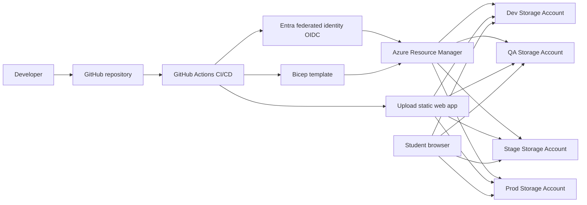
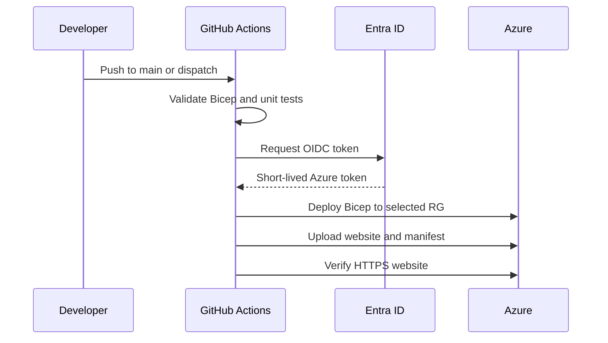

# Architecture

```mermaid
flowchart LR
 Developer[Developer] --> GitHub[GitHub repository]
 GitHub --> Actions[GitHub Actions CI/CD]
 Actions --> OIDC[Entra federated identity OIDC]
 OIDC --> Azure[Azure Resource Manager]
 Actions --> Bicep[Bicep template]
 Bicep --> Azure
 Azure --> Dev[Dev Storage Account]
 Azure --> QA[QA Storage Account]
 Azure --> Stage[Stage Storage Account]
 Azure --> Prod[Prod Storage Account]
 Actions --> Upload[Upload static web app]
 Upload --> Dev & QA & Stage & Prod
 Browser[Student browser] --> Dev & QA & Stage & Prod
```

```mermaid
sequenceDiagram
 participant D as Developer
 participant G as GitHub Actions
 participant E as Entra ID
 participant A as Azure
 D->>G: Push to main or dispatch
 G->>G: Validate Bicep and unit tests
 G->>E: Request OIDC token
 E-->>G: Short-lived Azure token
 G->>A: Deploy Bicep to selected RG
 G->>A: Upload website and manifest
 G->>A: Verify HTTPS website
```
